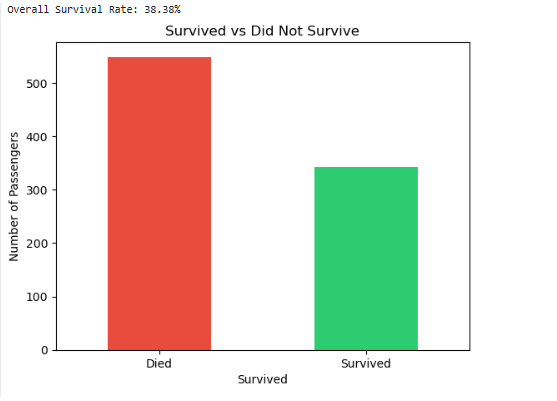
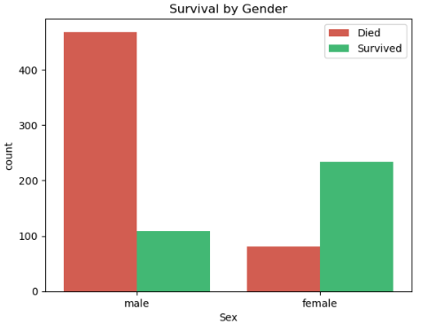
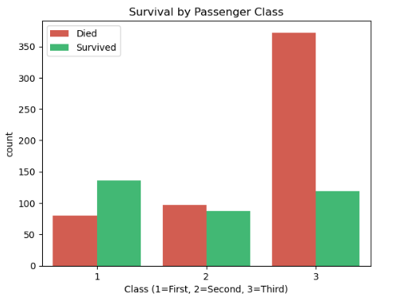
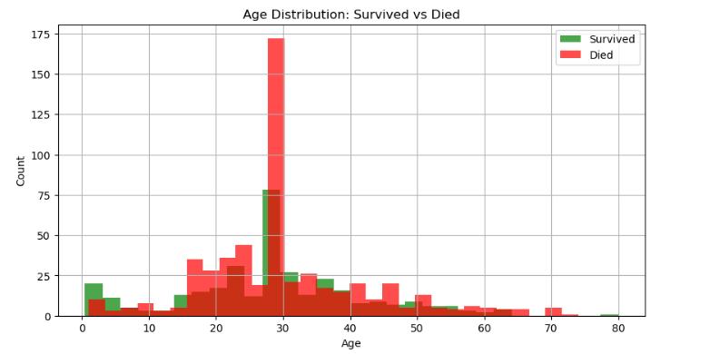
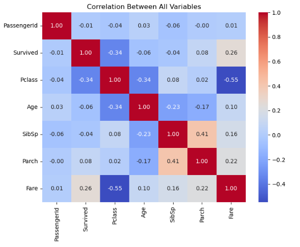

**TITANIC SURVIVAL ANALYSIS**

**Project Overview**

This project performs exploratory data analysis on the Titanic dataset to identify patterns and factors that influenced passenger survival. The analysis focuses on data cleaning, feature understanding, and visual insights using Python.

**Problem Statement**

The goal is to analyze passenger data and determine how attributes such as gender, class, and age impacted survival outcomes.

**Approach**

Cleaned missing and inconsistent data
Performed exploratory data analysis (EDA)
Used visualizations to identify trends and relationships
Interpreted results to extract meaningful insights

**Tech Stack**

-Python
-Pandas
-Matplotlib
-Seaborn
-Dataset

The dataset used is the Titanic dataset, widely used in data science for classification and analysis tasks.

**Key Insights**

- Overall survival rate was 38.4 percent
- Female passengers had a much higher survival rate (74.2 percent) than males (18.9 percent)
- First-class passengers had significantly higher survival (63 percent) compared to third-class passengers (24.2 percent)
- Younger passengers had better survival chances, with an average survivor age of 28.3 years

**Results**

The analysis clearly shows that gender and passenger class were the most influential factors affecting survival. Social and economic status played a major role in determining outcomes.

**Project Structure**

**Titanic-Analysis/

--> Titanic_Analysis.ipynb

--> train.csv

--> README.md**

**How to Run**

**1. Clone the repository**

git clone https://github.com/kosurisaipriyanka/titanic-analysis.git

**2. Install dependencies**

pip install pandas matplotlib seaborn

**3. Run the notebook**

jupyter notebook Titanic_Analysis.ipynb

**Skills Demonstrated**

- Data Cleaning and Preprocessing
- Exploratory Data Analysis
- Data Visualization
- Analytical Thinking and Insight Generation

## Visualizations

### Survival Count

Only a small portion of passengers survived compared to those who died.

---

### Survival by Gender

Women had a significantly higher survival rate than men.

---

### Survival by Passenger Class

First-class passengers had better survival compared to lower classes.

---

### Age Distribution

Younger passengers had relatively better survival chances.

---

### Correlation Between Variables

Shows relationships between different features in the dataset.

**Future Improvements**

Build a machine learning model for survival prediction
Perform feature engineering for better insights
Deploy as an interactive dashboard
